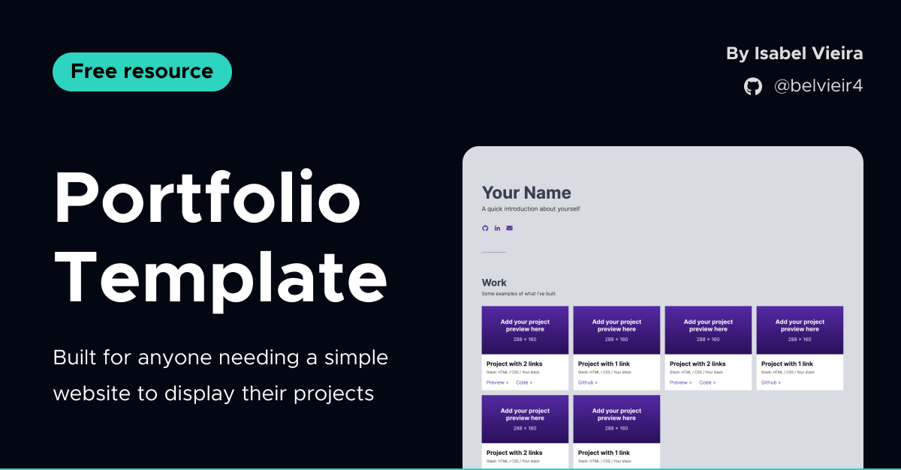

# Simple Portfolio Template

✨ **A portfolio template built for anyone needing a simple website to display their projects.** ✨

You need to know **basic HTML and CSS** to use this template. :)

> You can clone or fork this repository and customize it as you wish.

### [View the live preview of this template](https://belvieir4.github.io/portfolio-template/)

## Suggestions and Resources

Here are some things that can help you customize your portfolio:

- Use [Github Pages](https://pages.github.com):

  - Host your portfolio using Github Pages - it's free and easy to set up from your repo
  - Add your projects to GitHub Pages and add the links to both the repository and the respective Github Page on each project

- Use [Coloors](https://coolors.co) or any other colour palette generator to find a colour scheme that resonates with you and add it to your project

- Create your personal favicon with the [favicon.io tool](https://favicon.io) and replace the puzzle from the template

- Change the typography/font - you can use [Google Fonts](https://fonts.google.com) or add a custom font to your website

## Author

- Isabel Vieira - [belvieir4](https://github.com/belvieir4)

## Final comments

💙 You can change the footer if you want, but I'd appreciate it if you mentioned me as the template's creator.

🌟 Star me on GitHub if you use this template, that you'll encourage me to keep building things like this for the community.
